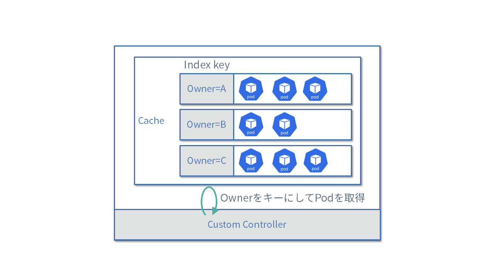

# Manager

[Manager](https://pkg.go.dev/sigs.k8s.io/controller-runtime/pkg/manager?tab=doc#Manager)は、
複数のコントローラーを管理し、リーダー選出機能やメトリクスやヘルスチェックサーバーなどの機能を提供します。

すでにこれまでManagerのいくつかの機能を紹介してきましたが、他にもたくさんの便利な機能を持ってるのでここで紹介していきます。

## Leader Election

カスタムコントローラーの可用性を向上させたい場合、Deploymentの機能を利用してカスタムコントローラーのPodを複数個立ち上げます。
しかし、Reconcile処理が同じリソースに対して何らかの処理を実行した場合、競合が発生してしまいます。

そこで、Managerはリーダー選出機能を提供しています。
これにより複数のプロセスの中から1つだけリーダーを選出し、リーダーに選ばれたプロセスだけがReconcile処理を実行できるようになります。

リーダー選出の利用方法は、`NewManager`のオプションの`LeaderElection`にtrueを指定し、`LeaderElectionID`にリーダー選出用のIDを指定するだけです。
リーダー選出は、同じ`LeaderElectionID`を指定したプロセスの中から1つだけリーダーを選ぶという挙動になります。

[import:"new-manager",unindent:"true"](../../codes/50_completed/cmd/main.go)

それでは、[config/manager/manager.yaml](../../codes/50_completed/config/manager/manager.yaml)の`replicas`フィールドを2に変更して、MarkdownViewコントローラーをデプロイしてみましょう。

デプロイされた2つのPodのログを表示させてみると、リーダーに選出された方のPodだけがReconcile処理をおこなっている様子が確認できます。
リーダーに選出されたPodを終了させると、もう片方のPodにリーダーが切り替わる様子を確認できます。

なお、Admission Webhook処理は競合の心配がないため、リーダーではないプロセスも呼び出されます。

## Runnable

カスタムコントローラーの実装において、Reconcile Loop以外にもgoroutineを立ち上げて定期的に実行したり、何らかのイベントを待ち受けたりしたい場合があります。
Managerではそのような処理を実現するための仕組みを提供しています。

例えばTopoLVMでは、定期的なメトリクスの収集やgRPCサーバーの起動用にRunnableを利用しています。

- [https://github.com/topolvm/topolvm/tree/main/runners](https://github.com/topolvm/topolvm/tree/main/runners)

Runnable機能を利用するためには、[Runnable](https://pkg.go.dev/sigs.k8s.io/controller-runtime/pkg/manager?tab=doc#Runnable)インタフェースを実装した以下のようなコードを用意します。
ここでは10秒周期で何らかの処理をおこなうRunnerを実装しています。

```go
package runners

import (
    "context"
    "fmt"
    "time"
)

type Runner struct {
}

func (r Runner) Start(ctx context.Context) error {
    ticker := time.NewTicker(10 * time.Second)
    defer ticker.Stop()
    for {
        select {
        case <-ctx.Done():
            return ctx.Err()
        case <-ticker.C:
            fmt.Println("run something")
        }
    }
}

func (r Runner) NeedLeaderElection() bool {
    return true
}
```

StartメソッドはManagerのStartを呼び出した際に、goroutineとして呼び出されます。
引数の`context`によりManagerからの終了通知を受け取ることができます。

```go
err = mgr.Add(&runners.Runner{})
```

なお、このRunnerの処理は通常リーダーとして動作しているManagerでしか動きません。
リーダーでなくても常時動かしたい処理である場合、[LeaderElectionRunnable](https://pkg.go.dev/sigs.k8s.io/controller-runtime/pkg/manager?tab=doc#LeaderElectionRunnable)インタフェースを実装し、
NeedLeaderElectionメソッドで `false` を返すようにします。

## EventRecorder

カスタムリソースのStatusには、現在の状態が保存されています。
一方、これまでどのような処理が実施されてきたのかを記録したい場合、Kubernetesが提供する[Event](https://pkg.go.dev/k8s.io/api/core/v1?tab=doc#Event)リソースを利用できます。

Managerはイベントを記録するための機能を提供しており、`GetEventRecorderFor`で[EventRecorder](https://pkg.go.dev/k8s.io/client-go/tools/record?tab=doc#EventRecorder)を取得できます。
以下のように、Reconcilerを初期化する際にEventRecorderを渡します。

[import:"init-reconciler",unindent:"true"](../../codes/50_completed/cmd/main.go)

Reconcilerではこれをフィールドとして持っておきます。

[import:"reconciler",unindent:"true"](../../codes/50_completed/internal/controller/markdownview_controller.go)

Eventを記録するための関数として、`Event`, `Eventf`, `AnnotatedEventf`などが用意されています。
ここでは、ステータス更新時に以下のようなイベントを記録することにしましょう。なお、イベントタイプには`EventTypeNormal`, `EventTypeWarning`のみ指定できます。

[import:"call-recorder-event",unindent:"true"](../../codes/50_completed/internal/controller/markdownview_controller.go)

このEventリソースは第1引数で指定したリソースに結びいており、そのリソースと同じnamespaceにEventリソースが作成されます。
カスタムコントローラーがEventリソースを作成できるように、以下のようなRBACのマーカーを追加し、`make manifests`でマニフェストを更新しておきます。

```go
//+kubebuilder:rbac:groups=core,resources=events,verbs=create;update;patch
```

コントローラーを実行し、作成したEventリソースを確認してみましょう。なお、Eventリソースはデフォルト設定では1時間経つと消えてしまいます。

```
$ kubectl get events -n default
LAST SEEN   TYPE     REASON    OBJECT                             MESSAGE
14s         Normal   Updated   markdownview/markdownview-sample   MarkdownView(default:markdownview-sample) updated: NotReady
13s         Normal   Updated   markdownview/markdownview-sample   MarkdownView(default:markdownview-sample) updated: Healthy
```

## HealthProbe

Managerには、ヘルスチェック用のAPIのエンドポイントを作成する機能が用意されています。

ヘルスチェック機能を利用するには、Managerの作成時に`HealthProbeBindAddress`でエンドポイントのアドレスを指定します。

[import:"new-manager",unindent:"true"](../../codes/50_completed/cmd/main.go)

そして、`AddHealthzCheck`と`AddReadyzCheck`で、ハンドラの登録をおこないます。
デフォルトでは`healthz.Ping`という何もしない関数を利用していますが、独自関数の登録も可能です。

[import:"health",unindent:"true"](../../codes/50_completed/cmd/main.go)

カスタムコントローラーのマニフェストでは、このヘルスチェックAPIを`livenessProbe`と`readinessProbe`として利用するように指定されています。

[import:"probe",unindent:"true"](../../codes/50_completed/config/manager/manager.yaml)

## FieldIndexer

[クライアントの使い方](./client.md)で紹介したように、複数のリソースを取得する際にラベルやnamespaceで絞り込むことが可能です。
しかし、特定のフィールドの値に応じてフィルタリングしたいこともあるでしょう。
controller-runtimeではインメモリにキャッシュしているリソースに対してインデックスを張る仕組みが用意されています。



インデックスを利用するためには事前にManagerの`GetFieldIndexer()`を利用して、どのフィールドの値に基づいてインデックスを張るのかを指定します。
下記の例ではConfigMapリソースに対して、`ownerReferences`に指定されているMarkdownViewリソースの名前でインデックスを作成しています。

```go
const ownerControllerField = ".metadata.ownerReference.controller"

func indexByOwnerMarkdownView(obj client.Object) []string {
    cm := obj.(*corev1.ConfigMap)
    owner := metav1.GetControllerOf(cm)
    if owner == nil {
        return nil
    }
    if owner.APIVersion != viewv1.GroupVersion.String() || owner.Kind != "MarkdownView" {
        return nil
    }
    return []string{owner.Name}
}

func (r *MarkdownViewReconciler) SetupWithManager(mgr ctrl.Manager) error {
    err := mgr.GetFieldIndexer().IndexField(ctx, &corev1.ConfigMap{}, ownerControllerField, indexByOwnerMarkdownView)
    if err != nil {
        return err
    }
    return nil
}
```

`IndexField`の第3引数のフィールド名には、どのフィールドを利用してインデックスを張っているのかを示す文字列を指定します。
ここでは、`.metadata.ownerReference.controller`という文字列を指定しています。
実際にインデックスに利用しているフィールドのパスと一致していなくても問題はないのですが、一致させると可読性がよくなるのでおすすめです。

なおインデックスはGVKごとに作成されるので、異なるタイプのリソース間でフィールド名が同じになっても問題ありません。
またnamespaceスコープのリソースの場合は、内部的にフィールド名にnamespace名を付与して管理しているので、明示的にフィールド名にnamespaceを含める必要はありません。
インデクサーが返す値はスライスになっていることから分かるように、複数の値にマッチするようなインデックスの構成も可能です。

上記のようなインデックスを作成しておくと、`List()`を呼び出す際に特定のフィールドが指定した値と一致するリソースだけを取得できます。
例えば以下の例であれば、ownerReferenceに指定したMarkdownViewリソースがセットされているConfigMapだけを取得できます。

```go
var cms corev1.ConfigMapList
err := r.List(ctx, &cms, client.MatchingFields(map[string]string{ownerControllerField: mdView.Name}))
if err != nil {
    return err
}
```

