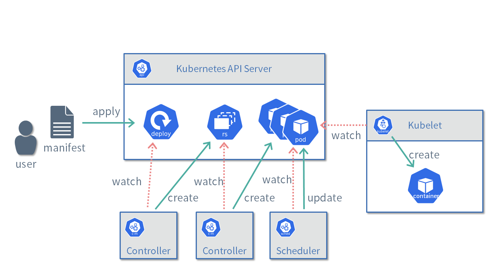

# カスタムコントローラーの基礎

ここではカスタムコントローラーを開発する上で必要となるKubernetesの基礎知識を解説します。

## Declarative

Kubernetesにおいてもっとも重要なコンセプトがDeclarative(宣言的) APIです。

例えば、Kubernetes上にNginxをデプロイしたい場合は、以下のようなYAML形式で記述されたマニフェストを用意して、Deploymentリソースを作成します。

```yaml
apiVersion: apps/v1
kind: Deployment
metadata:
  name: nginx-deployment
spec:
  selector:
    matchLabels:
      app.kubernetes.io/name: nginx
  replicas: 3
  template:
    metadata:
      labels:
        app.kubernetes.io/name: nginx
    spec:
      containers:
      - name: nginx
        image: nginx:latest
```

Kubernetes内ではさまざまなリソースを管理するコントローラーが動いています。
Deploymentを管理するコントローラーは、kube-apiserver上にDeploymentリソースが登録されると対応するReplicaSetリソースを新たに作成します。
次にReplicaSetを管理するコントローラーは、ReplicaSetリソースが登録されると`spec.replicas`に指定された3つのPodを新たに作成します。
さらににkube-schedulerというプログラムは、kube-apiserver上にPodリソースが登録されると、Podを配置するノードを決定しPodの情報を更新します。
各ノードで動作しているkubeletというプログラムは、自分のノード名が記述されたPodリソースを見つけるとコンテナを立ち上げます。



Deploymentリソースの`spec.replicas`の数を増やすと、それに合わせてコントローラーはPodの数を増やします。逆に`spec.replicas`を減らすとPodを削除します。

このようにKubernetesではユーザーが宣言したマニフェストをもとに複数のプログラムが連携し、システムがあるべき状態(ここでは3つのNginxのインスタンスが起動している状態)になるように調整していきます。

Imperative(命令型)ではなくDeclarative(宣言的)な仕組みとすることで、Kubernetes上で動作するアプリケーションは高い可用性とスケーラビリティを実現できます。
しかしながら、コントローラーはさまざまな状況を考慮する必要があるため、その実装はとても難しいものとなるでしょう。

## CRD(Custom Resource Definition)とCR(Custom Resource)

KubernetesにはDeploymentやPodを始めとしてたくさんの標準リソースが用意されています。
標準リソースだけでもある程度システムの構築は可能なものの、例えば証明書発行やMySQLクラスターの管理をKubernetes上で自動化したい場合は独自のリソースが必要になるでしょう。

そこで、Kubernetesの利用者が自由に新しいリソースを利用するための仕組みとしてカスタムリソース(CR: Custom Resource)が用意されています。

カスタムリソースを利用するためには、その定義としてCRD(Custom Resource Definition)を用意する必要があります。
CRDでは下記のようにOpenAPI v3.0の形式でバリデーションを記述することが可能になっています。

- [CRDの例](https://github.com/zoetrope/kubebuilder-training/blob/master/codes/50_completed/config/crd/bases/view.zoetrope.github.io_markdownviews.yaml)

## カスタムコントローラー

Kubernetesにおいて、あるリソースの状態をチェックして何らかの処理をおこなうプログラムのことをコントローラーと呼びます。
例えば、Deploymentリソースに基づいてReplicaSetリソースを作成しているのも1つのコントローラーです。

Kubernetesのソースコードを見てみると、標準リソースに対応する数多くのコントローラーが存在することを確認できます。

- https://github.com/kubernetes/kubernetes/tree/master/pkg/controller

これに対してユーザーが定義したカスタムリソースを対象としたコントローラーのことをカスタムコントローラーと呼びます。

以降では、コントローラーを実装する上で重要な考え方を紹介します。

### Reconciliation Loop

Reconciliation Loopは、コントローラーのメインロジックです。

リソースに記述された状態を理想とし、システムの現在の状態と比較し、その差分がなくなるように調整する処理を実行し続けます。


先ほどのDeploymentの例であれば、3つのPodの存在する状態が理想であり、Reconciliation LoopではPodの数を増やしたり減らしたりして理想の状態と一致するように処理します。

### 冪等

Reconciliation Loopは冪等性を備えていなければなりません。

先ほど例に上げたPodコントローラーを考えてみましょう。
このコントローラーはあるべき状態としてPodが3つだと宣言されていたら、Reconcileが何度呼ばれてもPodの数が3つにしなければなりません。
Podが3つある状態でReconcileが呼び出されたときにさらに3つのPodをつくってしまったり、エラーを出してしまったりしてはいけないのです。

これは当たり前のことのように感じられるかもしれませんが、Kubernetes登場前のImperativeなインフラ自動化ツールでは、冪等性を備えていないものもよく見かけられました。

### エッジドリブントリガーとレベルドリブントリガー

Reconciliation Loopは、リソースが新しく登録や編集されたり、対象のシステムの状態が変化したときに適切な処理をしなければなりません。
先ほどの例であれば、Deploymentリソースに記述されたレプリカ数が増えた場合やサーバーが故障してPodの数が減ってしまった場合などには、新しいPodを作成する必要があります。

このとき、状態が変化したイベントに応じて処理を実行することをエッジドリブントリガーと呼び、
現在の状態に応じて処理を実行することをレベルドリブントリガーと呼びます。 
([参考](https://hackernoon.com/level-triggering-and-reconciliation-in-kubernetes-1f17fe30333d))


図にあるように、Reconciliation Loopがイベント(Replica数の増減)のみを見ていた場合、
もし何らかの原因(コントローラーの故障など)でイベントをロストしてしまうと、あるべき状態と現在の状態がずれてしまうことになります。
一方で現在の状態(現在のReplica数)を見ていた場合は、イベントをロストしたとしてもあるべき状態に収束させることが可能です。

Kubebuilderが提供するフレームワークでは、さまざまなイベントが発生したときにReconciliation Loopが呼び出されるようになっています。
ただし、そのときにReconciliation Loopは、値がどのように変化したのかという情報を受け取りません。
必ず現在の状態をチェックして、その状態に応じた処理を実装する必要があります。
このような仕組みとすることで、イベントのロストや故障に強いコントローラーの実装が可能になっています。
