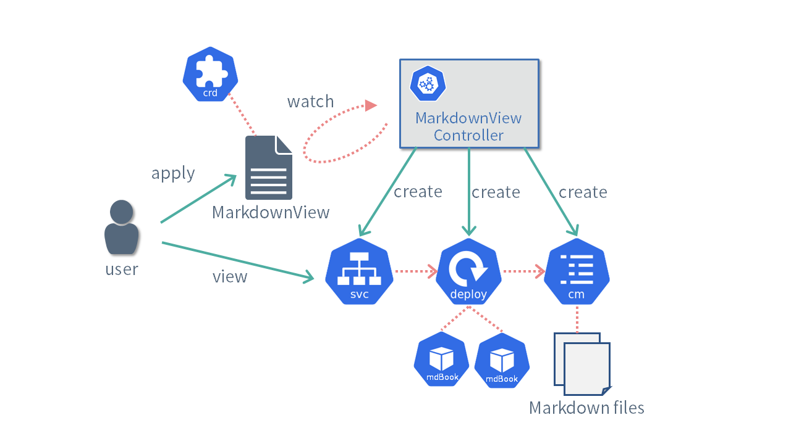

# 作成するカスタムコントローラ

本資料では、カスタムコントローラの例としてMarkdownViewコントローラを実装することとします。
MarkdownViewコントローラは、ユーザーが用意したMarkdownをレンダリングしてブラウザから閲覧できるようにサービスを提供するコントローラです。

MarkdownのレンダリングにはmdBookを利用することとします。

- https://rust-lang.github.io/mdBook/

MarkdownViewコントローラの主な処理の流れは次のようになります。

- ユーザーはMarkdownViewカスタムリソースを作成します。
- MarkdownViewコントローラは、作成されたMarkdownViewリソースの内容に応じて必要な各リソースを作成します。
  - カスタムリソースに記述されたMarkdownをConfigMapリソースとして作成します。
  - MarkdownをレンダリングするためのmdBookをDeploymentリソースとして作成します。
  - mdBookにアクセスするためのServiceリソースを作成します。
- ユーザーは、作成されたサービスを経由して、レンダリングされたMarkdownを閲覧できます。

MarkdownViewカスタムリソースには、以下のようにMarkdownの内容とレンダリングに利用するmdBookのコンテナイメージおよびレプリカ数を指定できるようにします。

[import](../../codes/markdown-viewer/config/samples/viewer_v1_markdownview.yaml)

ソースコードは以下にあるので参考にしてください。

- https://github.com/zoetrope/kubebuilder-training/tree/master/codes/markdown-viewer
